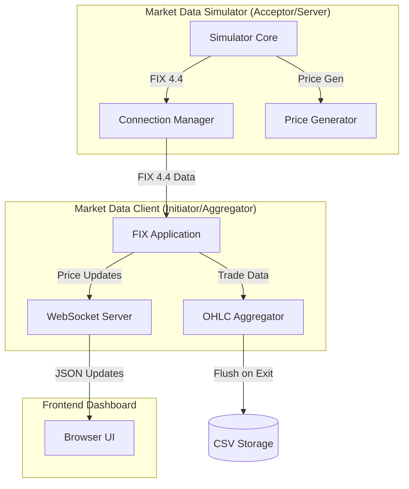

# FIX Market Data System: Code & Flow Explainer

This document provides a deep dive into the architecture, component responsibilities, and data flow of the FIX Market Data System.

## High-Level Architecture

The system follows a distributed architecture with three primary layers:



---

## 1. Market Data Simulator (`MarketDataSimulator`)
**Location**: `MarketDataSimulator/market_data_simulator.cpp`

The Simulator acts as the "Exchange." It generates synthetic market data and manages client subscriptions.

### Key Components:
- **`MarketDataSimulator` Class**: Inherits from `FIX::Application` and `FIX::MessageCracker`.
    - `onMessage(MarketDataRequest)`: Handles new subscriptions from clients.
    - `priceUpdateLoop()`: A background thread that generates a random price walk every 100ms.
    - `broadcastUpdate()`: Sends `MarketDataIncrementalRefresh (X)` messages to all subscribed sessions.
- **Price Generation**: Uses `std::default_random_engine` and `std::uniform_real_distribution` to simulate price movements (adjusted for JPY volatility).

---

## 2. Market Data Client (`MarketDataClient`)
**Location**: `MarketDataClient/`

The Client is the "Brain" of the system. It consumes FIX data, processes it into bars, and serves it to the frontend.

### Key Components:
- **`FIXMarketDataApp` (`FIXMarketDataApp.h`)**:
    - `onLogon()`: Automatically subscribes to EURUSD, GBPUSD, and USDJPY.
    - `onMessage(Snapshot)` & `onMessage(Incremental)`: Extracts Bid/Ask/Trade data.
    - `pushWSUpdate()`: Queues prices for the WebSocket server.
- **`OHLCBarAggregator` (`OHLCBarAggregator.h`)**:
    - Maintains bars for multiple timeframes (30s, 1m, 5m, 1h).
    - Writes completed bars to CSV files in `OHLC_price_data/`.
- **`main.cpp` (WebSocket Server)**:
    - Uses `ixwebsocket` to host a server on port `9002`.
    - Broadcasts price updates to all connected frontends every 1000ms (configurable via `FrontendUpdateInterval` in `client.cfg`).

---

## 3. Data Flow & Life Cycle

### A. Subscription Flow
1. **Client** starts and sends `Logon (A)`.
2. **Simulator** accepts and sends `Logon (A)`.
3. **Client** sends `MarketDataRequest (V)` for specific symbols.
4. **Simulator** records the subscription and sends an initial `MarketDataSnapshotFullRefresh (W)`.

### B. Price Update Flow (The "Fast Path")
1. **Simulator** thread updates internal prices every 100ms.
2. **Simulator** sends `MarketDataIncrementalRefresh (X)` via QuickFIX.
3. **Client** receives message in `fromApp` -> `crack` -> `onMessage`.
4. **Client** extracts price:
    - If it's a **Trade**: Sends it to `OHLCBarAggregator`.
    - **Always**: Pushes to `m_wsQueue` for the WebSocket broadcast.
5. **Client Main Loop** (every 50ms):
    - Drains `m_wsQueue` into a `priceCache`.
    - Every 1000ms, iterates through `priceCache` and sends JSON to all **Frontend** clients.

### C. Shutdown Flow
1. User presses `Ctrl+C`.
2. `ConsoleHandler` sets `g_running = false`.
3. **Client** calls `ohlc.flushAll()`, ensuring any partial bars are saved to CSV.
4. QuickFIX initiator and WebSocket server are stopped gracefully.

---

## 4. Key Utilities

- **Thread-Safe Logger (`Logger.h`)**:
    - Centralized logging for all components.
    - Levels: `INFO`, `WARN`, `ERR`.
    - Outputs to both console and `log/*.log` files.
- **Settings (`client.cfg` / `server.cfg`)**:
    - Controls FIX session parameters (SenderID, TargetCompID, HeartBtInt).
    - Custom settings like `FrontendUpdateInterval` are parsed from these files.

---

## 5. Binary Distribution & Setup (For External Users)

If you are providing your compiled binaries to someone else, they must ensure the following environment is set up for the applications to run correctly.

### Required File Structure
The recipient should have the following folder structure:
```text
/ProjectRoot
├── MarketDataSimulator.exe
├── MarketDataClient.exe
├── server.cfg
├── client.cfg
├── FIX44.xml (Data Dictionary - REQUIRED)
└── /frontend/ (HTML/JS/CSS files)
```

### Config Changes for the Recipient

#### A. Network Configuration (`client.cfg`)
By default, the client looks for the simulator on `localhost`. If the binaries are on different machines:
- Change `SocketConnectHost` in `client.cfg` to the IP address of the machine running `MarketDataSimulator.exe`.
- Ensure the `SocketConnectPort` matches the `SocketAcceptPort` in `server.cfg` (default is `9001`).

#### B. Data Dictionary (`FIX44.xml`)
The `DataDictionary` path in both `.cfg` files must point to a valid XML specification file. **The binaries will crash if this file is missing or the path is incorrect.**

#### C. Frontend Connection (`app.js`)
If the user is opening the frontend from a different machine than the one running `MarketDataClient.exe`:
- They must open `frontend/app.js` and update the WebSocket URL:
  ```javascript
  // Change 'localhost' to the IP of the machine running MarketDataClient.exe
  const socket = new WebSocket('ws://<CLIENT_MACHINE_IP>:9002');
  ```

#### D. Performance Tuning
- **`FrontendUpdateInterval`**: In `client.cfg`, they can adjust how often the dashboard updates (in milliseconds). Higher values reduce network traffic.
