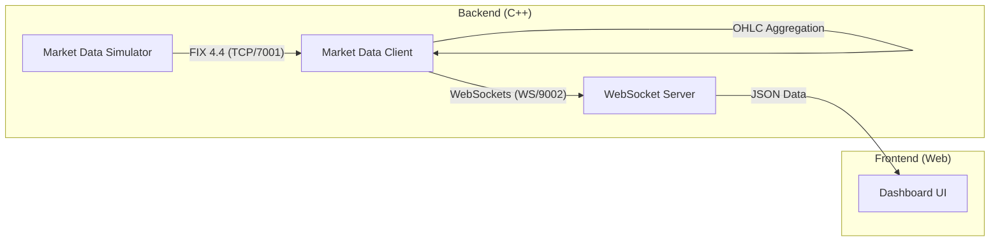

# FIX Market Data System

A high-performance C++ Market Data System using the **FIX 4.4** protocol. This project implements a real-time market data simulator and a client that aggregates data into OHLC bars and distributes it via WebSockets to a web-based dashboard.

## 🏗️ Architecture

The system consists of three main components:



1.  **Market Data Simulator**: Acts as a FIX Acceptor, generating synthetic market data (Bid/Ask prices) for various symbols.
2.  **Market Data Client**: Acts as a FIX Initiator, receiving real-time ticks, aggregating them into OHLC (Open, High, Low, Close) bars, and broadcasting them.
3.  **Frontend Dashboard**: A responsive web interface that connects via WebSockets to visualize live market updates.

---

## 🚀 How to Start

### 1. Prerequisites
- **Visual Studio 2022 or 2026** (with C++ Desktop Development workload).
- **CMake** (3.12 or higher).
- **vcpkg** (C++ package manager).

### 2. Install Dependencies
Run the following command in the project root to install required libraries via vcpkg:
```powershell
vcpkg install
```
*Dependencies: `quickfix`, `ixwebsocket`, `nlohmann-json`.*

### 3. Build the Project
1. Open the project folder in Visual Studio or use the command line:
   ```powershell
   mkdir build
   cd build
   cmake ..
   cmake --build . --config Debug
   ```
2. The executables will be generated in `build/Debug/`.

### 4. Running the System
To see the full flow, run the components in this order:

1.  **Start the Simulator**:
    - Run `build/Debug/MarketDataSimulator.exe`.
    - It will load `server.cfg` and wait for connections on port 7001.
2.  **Start the Client**:
    - Run `build/Debug/MarketDataClient.exe`.
    - It will connect to the simulator, start receiving FIX messages, and open a WebSocket server on port 9002.
3.  **Launch the Dashboard**:
    - Open `frontend/index.html` in any modern web browser.
    - The dashboard will automatically connect to `ws://localhost:9002` and display real-time data.

---

## 📂 Project Structure

- `MarketDataSimulator/`: Source code for the FIX server/simulator.
- `MarketDataClient/`: Source code for the client, aggregation logic, and WebSocket server.
- `frontend/`: HTML/CSS/JS files for the real-time dashboard.
- `Application/`: Core logic and FIX application implementations.
- `Logger.h`: Thread-safe logging utility used across the system.

---

## 🛠️ Configuration
- **FIX Sessions**: Configured in `MarketDataSimulator/server.cfg` and `MarketDataClient/client.cfg`.
- **Data Dictionary**: Uses standard `FIX44.xml` (copied to output directory during build).
- **WebSocket**: Port and broadcast settings are managed within the `MarketDataClient`.

---
*Developed using VS 2026.*
